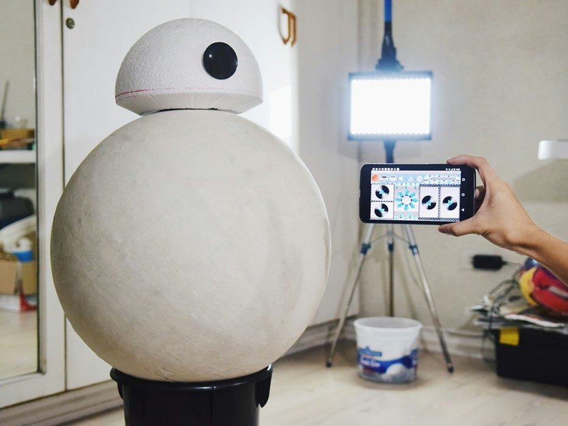

# Droid BB8 de tamaño real controlado por teléfono
## Introducción
Unos simples desodorantes de roll-on para la base forman parte de la loista de materiales reciclados y que podemos encontrar en casa y con los que este genio del mundo maker se ha construido un robot BB8 a tamaño real. Luego, con una placa Arduino y conectividad bluetooth se permite el lujo de poder controlarlo desde su propio smarpthone. Increíble y muy motivador por el inteligente uso que hace de materiales que todos podemos tener por casa y sin uso "tecnológico" aparente.
First Header | Second Header
------------ | -------------
Content from cell 1 | Content from cell 2
Content in the first column | Content in the second column
## Procedimiento
* **Paso 1**
  * Diseño de ingeniería inversa BB8
* Paso 2
  * Reúna las piezas y los materiales (Tabla 1)
* Paso 3
  * Inflar la pelota de playa
* Paso 4
  * Prepare la mezcla de pegamento de PVA
* Paso 5
  * Prepare las tiras de periódico
* Paso 6
  * Haz el papel maché
* Paso 7
  * Agregue una capa de lienzo
## Limitaciones
* Al estar conectado aun dispositivo mediante un tipo de conexión Bluetooth es necesario mantener una distancia corta para que el Dorid BB8 siga funcionando.

